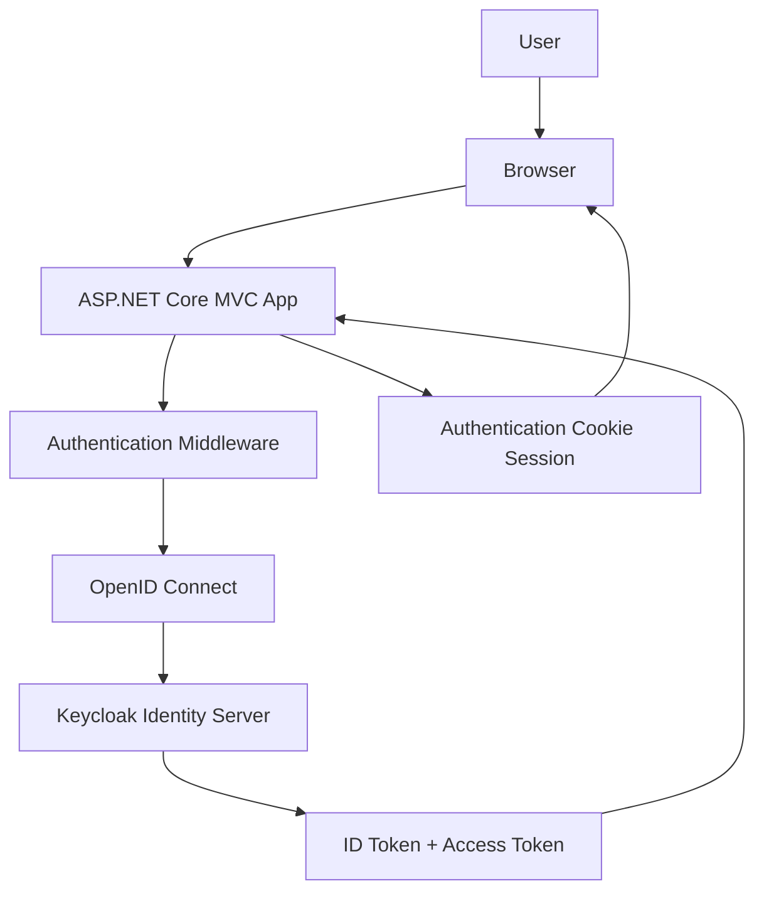
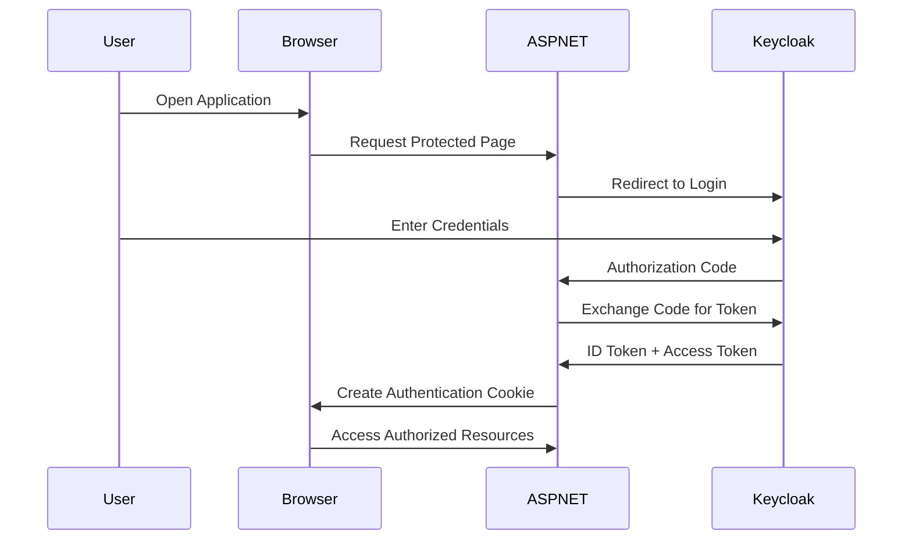

# ASP.NET Core Keycloak SSO MVC

Production-style **ASP.NET Core MVC application integrated with Keycloak Single Sign-On (SSO)** using **OpenID Connect authentication**.

This project demonstrates how to implement **enterprise authentication architecture** where **Keycloak acts as an Identity Provider** for ASP.NET Core applications.

It includes secure login, logout, role-based authorization, and claims mapping.

---

# Features

* Keycloak Single Sign-On (SSO)
* OpenID Connect Authentication
* Secure Cookie Authentication
* Role-Based Authorization
* Claims Mapping from Keycloak
* Centralized Identity Provider
* Secure Logout via Keycloak
* Clean Layered Architecture

---

# Tech Stack

* ASP.NET Core MVC
* Keycloak Identity Server
* OpenID Connect
* Cookie Authentication
* C#
* .NET

---

# Architecture



The application delegates authentication to **Keycloak Identity Server** using **OpenID Connect Authorization Code Flow**.

---

# Authentication Flow



---

# Authorization

The application uses **policy-based authorization**.

Example policy:

```
options.AddPolicy("AdminOnly", policy =>
    policy.RequireRole("admin"));
```

Example controller usage:

```
[Authorize(Policy = "AdminOnly")]
```

---

# Claims Mapping

After successful authentication, claims from Keycloak tokens are mapped into ASP.NET Core identity claims.

Example:

```
OnTokenValidated = context =>
{
    KeycloakClaimMapper.Map(context.Principal);
}
```

This allows the application to use **roles and claims provided by Keycloak**.

---

# Secure Logout Flow

Logout triggers a **Keycloak global logout**.

Flow:

1. User clicks logout
2. ASP.NET Core redirects to Keycloak logout endpoint
3. Keycloak invalidates the session
4. User is redirected back to the application

---

# Solution Structure

```
KeycloakSso.Mvc.sln
│
├── Web.Core
│
│   ├── Data
│   │   └── ApplicationDbContext.cs
│   │
│   ├── Domain
│   │   ├── Entities
│   │   ├── Requests
│   │   └── Responses
│   │
│   ├── Repositories
│   │   └── Interfaces
│   │
│   └── Services
│       └── Abstractions
│           └── ICurrentUser.cs
│
└── Web.Mvc
    │
    ├── Auth
    │   ├── AuthorizationPolicies.cs
    │   ├── CurrentUser.cs
    │   └── KeycloakClaimMapper.cs
    │
    ├── Controllers
    │   ├── AccountController
    │   ├── AdminController
    │   └── HomeController
    │
    ├── Models
    │
    ├── Views
    │
    └── Program.cs
```

This structure separates **core logic and presentation layer**, making the project easier to maintain and scale.

---

# Configuration

Keycloak configuration is stored in **appsettings.json**.

Example:

```
"Keycloak": {
  "Authority": "http://localhost:8080/realms/myrealm",
  "ClientId": "mvc-client",
  "ClientSecret": "client-secret"
}
```

---

# Running the Project

### 1 Install Keycloak

Run Keycloak locally:

```
bin/kc.sh start-dev
```

---

### 2 Create Realm

Example:

```
demo-realm
```

---

### 3 Create Client

Example configuration:

```
Client ID : mvc-client
Access Type : confidential
```

Redirect URI:

```
https://localhost:5001/signin-oidc
```

---

### 4 Run Application

```
dotnet run
```

Open in browser:

```
https://localhost:5001
```

---

# Future Improvements

Potential improvements:

* Refresh token support
* API authentication using JWT
* Multi-tenant identity support
* Role management UI
* Dockerized Keycloak environment
* Distributed session storage

---

# Purpose

This project demonstrates how to implement **enterprise authentication using Keycloak and ASP.NET Core MVC**.

It can be used as:
* authentication starter template for ASP.NET Core projects
* reference implementation for enterprise SSO integration
* developer portfolio project

---

# Author

**Hendi Dwi Purwanto**

Senior .NET Backend Engineer
